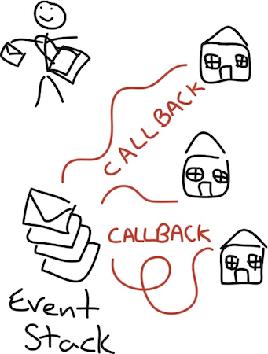

title: Real-Time APIs with Node
output: index.html
theme: theme
controls: false
logo: theme/logo.png

--

# Real-Time APIs with Node

--

## Real-Time push vs. pull

### Pull

Make HTTP (AJAX) requests periodically to see if something has changed.

### Push

Send and receive messages between a webserver.

#### __[Websockets](http://en.wikipedia.org/wiki/WebSocket)__

WebSocket is a protocol providing full-duplex communications channels over a single TCP connection designed to be implemented in web browsers and web servers

--
<h2 style="text-align: center;"></h2>

[Node.js](http://nodejs.org/) is a platform built on Chrome's V8 JavaScript runtime for easily building fast, scalable network applications.

* HTTP/HTTPS
* TCP/UDP Sockets
* Event Emitters
* Streams
* Files System Access
* Cross Platform

-- image

## How is Node Different?

It uses JavaScript in a single threaded event loop. There is a separate thread pool for IO requests. (Image credited to [Elegant Code](http://elegantcode.com/2011/07/05/taking-baby-steps-with-node-js-dont-block-the-event-loop/))



--

## JavaScript is asynchronous

```javascript
$.ajax('/polls', {
  success(data) {
     console.log('Got data', data);
  },
  error() {
     console.log('Error fetching data')
  }
});
```

In Node:

```javascript
request('/polls', function(error, response, data) {
  if(error) {
    console.log('Error fetching data')
  } else {
    console.log('Got data', data);
  }
});
```

--

## Modules

### The [__N__ode __P__ackage __M__anager](https://npmjs.org)

- currently hosts ~ 150000 modules
- easy to use (`npm install <package>`)
- easy to publish (`npm publish`)
- use it with anything (folders, tarballs, git repositories)

--

## Express + Feathers

### Express

Fast, unopinionated, minimalist web framework for Node.js

```javascript
import express from 'express';

const app = express()
  .use('/', express.static(__dirname));

app.listen(3000);
```

### Feathers

A microservice library on top of Express that can expose services
and their events via REST and Websockets.

--

## A Feathers application

```javascript
import feathers from 'feathers';

const myService = {
  find(params, callback) {},
  get(id, params, callback) {},
  create(data, params, callback) {},
  update(id, data, params, callback) {},
  patch(id, data, params, callback) {},
  remove(id, params, callback) {},
  setup(app, path) {}
}

const app = feathers()
  .configure(feathers.rest())
  .configure(feathers.socketio())
  .use('/todos', myService)
  .use('/', express.static(__dirname));

app.listen(3000);
```

--

## Real-time Proxy


--

# Brought to you by

-- presenter


## David Luecke

* [<i class="fa fa-github"></i> daffl](https://github.com/daffl)
* [<i class="fa fa-twitter"></i> @daffl](http://twitter.com/daffl)
